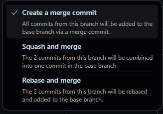
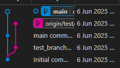
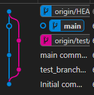
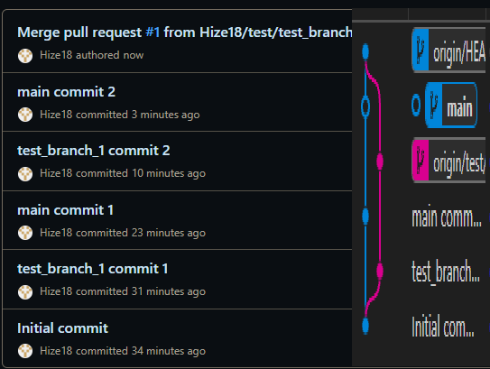
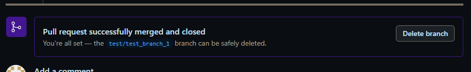

init -> test_branch_1 1 -> main 1 -> test_branch_1 2 -> main 2 -> merge to main 
이런 순서로 커밋을 했음.

Merge를 위해 test_branch_1에서 PR을 통해 main에 merge or rebase 요청을 함.

PR을 할 경우 Reviewer(지금은 혼자니까 본인)가 코드를 리뷰하고 승인 혹은 거부를 할 수 있음. 
 
그 경우 reviewer는 세가지 중 하나를 선택하는데 지금은 merge를 해 보았다.

 
main 2까지 커밋을 하고 merge를 할 경우 
 
이렇게 커밋이 main으로 통합이 됨.
 
main에 merge 커밋이 생기면서 기존 
init -> main 1 -> main 2 -> merge 
로 되고 merge가 되면서 main log로 통합이 된다.

추가로 궁금한 부분은 merge의 경우 통합 될 경우 로그들이 시간순으로 통합이 되는지 궁금. 
위의 이미지로 유추한 바로는 로그들이 시간순으로 통합 된다고 생각이 들어서 다음 공부에는 메인에 1개 test는 3개를 넣어서 테스트 해보자.

또한 PR로 merge가 된 경우 merge가 된 branch의 경우 삭제버튼이 생김(물론 PR이 아니여도 삭제가 가능은 하지만) 
 
그 경우 branch는 삭제가 되어서 직접적으로 branch는 보지 못 하지만, PR에 commit 카테고리에서 커밋 내역이나 file changed 카테고리로 확인이 가능함. 
그러면 PR에 branch의 이름과 commit log로 어떤 작업을 했는지 파악이 가능함.