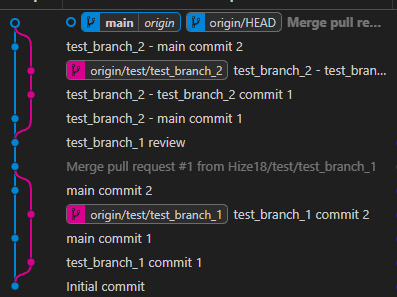

test_branch_2는 저번 test_branch_1의 결과가 시간순으로 정렬이 되는 것이 맞는지 체크하려고 진행.

test 1의 경우<br>
<br>
vscode의 경우 git graph가 이런 식으로 main 로그 뒤에 test 로그가 뒤 따라 나오고<br>
<br>
vscode의 extension의 git graph나 intellij의 graph는 이처럼 시간순으로 정렬이 되서 출력이 되는 상황.

<br>
그 상황에서 github에 커밋 로그가 시간순으로 정렬이 되어 있어서 확인차 진행하는 회차임.
---

커밋순서는 main 에서 1번, test_branch_2에서 2번 연속 후, main 에서 1번, 그리고 merge를 진행.
```aiignore
main 1 -> test 1 -> test 2 -> main 2 -> merge commit
```
이런 순서로 진행을 하였다.

결과는 다음과 같다.

<br>
```aiignore
main 1 -> test 1 -> test 2 -> main 2 -> merge commit
```

github에서는 기본적으로 merge를 할 경우 branch의 시작점과 merge commit 사이에 있는 커밋 로그들은 시간순으로 정렬이 된다.
물론 vscode만 봐도<br>
<br>
vscode 기본 git graph
<br>
vscode extension git graph<br>
이렇게 같은 vscode이지만 두가지의 graph가 나오는 것을 볼 수 있듯이, 설정에 따라 시간순이나 병합 흐름에 따른 graph를 보여 주는 것 같다.

어차피 github에서 보는 것 보다 IDE에서 커밋로그(graph)를 보는게 시각적으로 어떤 branch에서 어떤 커밋을 했는지 확인하기 편할 것 같다.
또한 PR에 있는 커밋 로그도 체크가 가능하니까.

---
2회차를 진행하였는데 둘다 똑같은 결과가 나온 것을 보아하니 설정에 따라 정렬 순서가 다를 뿐 결과는 같다고 판단이 됨.
merge는 이번 test_branch_2에서 마무리 하고 다음은 rebase부분을 해 볼 예정.

그 후에 merge나 rebase로 main파일을 수정할 경우 공부.