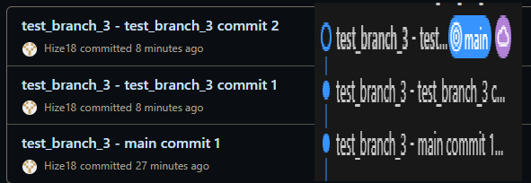
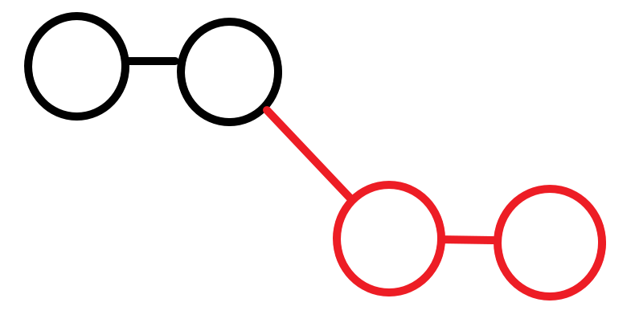
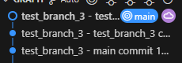
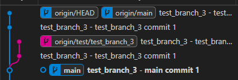
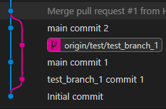

test_branch_3은 rebase 부분을 공부하기 위함.

우선 이번 branch는<br>
main에서 1개의 커밋을 진행. 그 다음 branch에서 2개의 커밋을 진행함.<br>
그 후 PR을 통해 rebase를 진행함.

결과는 다음과 같음.
```allignore
main 1 -> test 1 -> test 2
```
<br>
merge와는 다르게 따로 merge commit이 남는게 아니라<br>
rebase는 rebase로 하는 branch의 마지막 HEAD뒤에 이어서 커밋들이 정렬됨.
<br>
이와 같은 형식으로 진행이 됨.

<br>
vscode graph 및 github 커밋 로그<br>
<br>
vscode extension git graph<br>

특이한 점이 vscode의 graph는 rebase를 한 결과 graph가 출력되는 반면<br>
vscode의 extension은 branch가 남은 상태로 출력이됨.

여기서 의문이 보통 구글에 검색해서 공부할 때는 rebase는 main 커밋으로 정렬되어 들어오니까 branch가 뒤에 이어진다. 라고 생각을 하는데,<br>
rebase나 merge는 통합이 아닌 해당 branch들의 커밋 로그들을 main이 참조하는 것이라고 알 수 있다.

<br>
이 merge의 경우도 main은 두개의 커밋 로그만 가지고 있지만 merge를 할 경우 해당 branch의 커밋 로그들을 참조해서 main에서 한 눈에 볼 수 있다.

이를 통해 알게 된 점은 PR을 통해 merge나 rebase를 한 후에 branch를 삭제하는데, 실제로 삭제되는게 아님.
PR의 커밋로그들을 볼 수 있는 이유중 하나가<br>
<br>
이 처럼 branch는 저장이 되고 main 커밋로그에서 해당 로그들을 참조할 근거가 있어야 한다.<br>
그리고 branch를 삭제하는 것은 해당 branch의 완전 삭제가 아니라 HEAD에 대한 포인터를 제거한 것일 뿐 checkout은 가능하다.