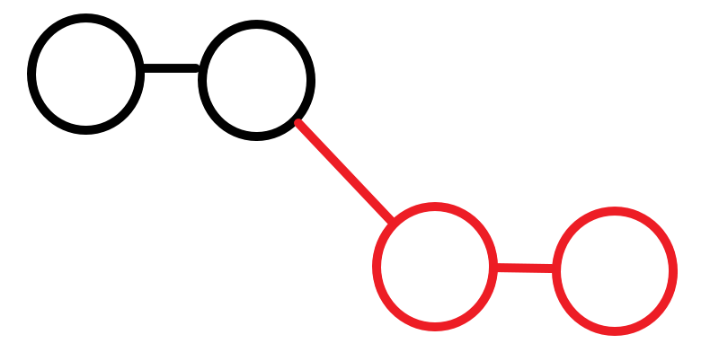
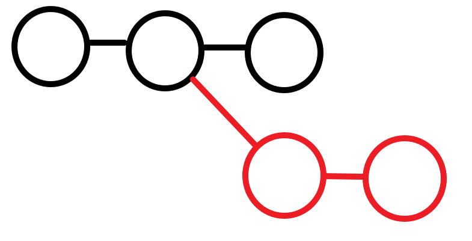
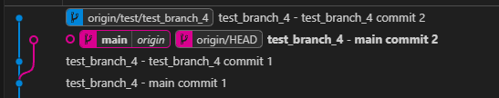
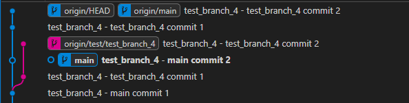

test_branch_4 정리

test_branch_3과 다르게 test_branch_4는
branch에서 커밋을 하는데 그 중간에 main에서 커밋을 하는 상황을 가정.

 
test_branch_3에서는 base branch에서 branch를 한 후 base branch에는 추가 커밋이 없음.

 
test_branch_4. 현재 공부하는 상황. base branch에 추가로 커밋이 생겼을때.

공부를 하기 전과 후의 결과가 같아서 정리하기 편한 부분.

rebase는 bbase branch에서 어떤 HEAD를 기반으로 branch를 하던 상관없이 base branch의 최신 HEAD뒤에 branch의 커밋들이 이어서 붙는다.

다음은 vscode의 git graph. 
 
PR전의 graph. main이 파란색인데 분기점을 파란색으로 tracing하고 있음.

 
PR을 한 후 커밋 로그.

이번 git graph는 색이 좀 다르게 tracing 되었는데, 1번 이미지를 보면 main과 branch에서 커밋한 내용들은 다를거 없음. 
PR을 하고 rebase를 한 후인 2번 이미지를 보면, branch의 로그들이 main에서 마지막으로 커밋을 한 로그 뒤로 이어서 붙는 것을 볼 수 있다.